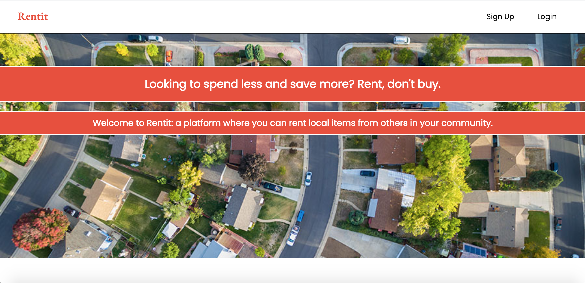
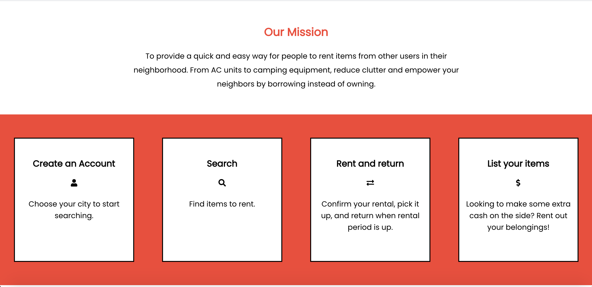

# Rentit

https://rentit-app.vercel.app/

## Summary

Rentit is a platform that allows users to rent items from other users in their city or neighborhood. Login using demo credentials (or sign up), search for available items, select an item and specify rental period, then use demo credit card information to check out. Users are also able to list their own items to rent. It is worth noting that there is a finite number of currently listed items that cannot be re-listed, so users are encouraged to not rent too many items; or better yet, list an item using the 'johnsmith@gmail.com' account and purchase/rent the item using a profile that you create via 'signup.' Thank you and enjoy renting!

## Screenshots

### Landing Page

### Login 

### Search 

### Checkout

### List 

### Profile

## Technologies Used

Built with React.js (HTML, CSS, and JavaScript)

